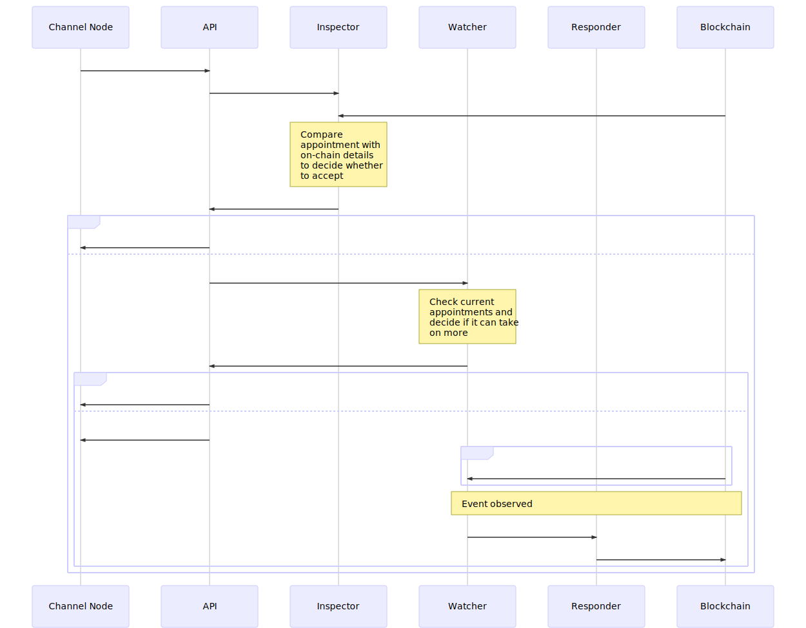

[](https://circleci.com/gh/PISAresearch/pisa/tree/124-nyc)
[](https://codecov.io/gh/PISAresearch/pisa)


# Pisa - The Accountable Third Party

This repository focuses on building an accountable third party service called Pisa that can be hired to watch channels on behalf of its users. The aim is to let anyone run a Pisa service and watch over several channel constructions (Kitsune, Counterfactual, Funfair, etc). We'll shortly present our architecture for this implementation of Pisa - but fundamentally it will let the Pisa service host "watchers" on several computers, and a central service is responsible for interacting with the state channel customer. 

## Short-term VS Long-term Goals

In the short-term, our plan is to build an MVP of Pisa that is free to use. We'll host it on several servers, and battle-test it in the wild. We hope our initial MVP will be compatible with Kitsune and Counterfactual, although new channels can be "plugged in" as required. 

In the long-term, we hope to build the full life-cycle below. 

## The Life-Cycle of Hiring Pisa 

The customer wants to hire the Pisa service to watch the channel on their behalf. Briefly, it'll involve the following: 

* Customer sends an appointment to Pisa (i.e. signatures from all parties, state hash, version)
* Pisa inspects the appointment (i.e. verify that its legitimate and can be used to resolve a future dispute)
* Pisa generates a secret "s" and hashes it to compute the receiptHash i.e. receiptHash = H(S). 
* Pisa sends the appointment (and the receiptHash) to all watchers under its control (i.e. independent servers running geth + watching service)
* All watchers will inspect the appointment (i.e. again, verify that its legitimate and can be used to resolve a future dispute) 
* Each watcher will sign a receipt, send it back to Pisa and start watching the customer's channel.  
* Once Pisa has received k of n signatures, all signatures are aggregated into a single signature. 
  * In other words, there will be a threshold scheme to ensure that a sufficient number of watchers have accepted the job before the receipt is signed by Pisa's public key. 
* Pisa will send the signed receipt back to the customer 
* Customer sets up the conditional transfer to Pisa
* Pisa reveals the secret "s" to the customer, and the transfer is complete. 

## Limitations of above design 

* The customer can send an appointment to Pisa, but not pay Pisa. 
  * Our focus is on resilience / dependability. We want to outsource the job to several watchers, and then not "cancel" it in the future. If a customer doesn't pay, then Pisa will refuse all future jobs from the customer's key + state channel. 
  * This isn't an issue with the Pisa protocol, but just our current architecture design. 

## Life-Cycle of an Appointment Request



## Docker

PISA is available as a docker image. To run PISA with a local instance of ganache download the docker-compose file at /docker/docker-compose.yml, then run:
```
docker-compose up
```
To stop PISA be sure to run:
```
docker-compose down
```
this safely shutdown containers and networks.
If you are experiencing network issues ensure that you aren't using a local VPN, and ensure that the last containers were safely terminated by runnin 'docker-compose down'.


To run PISA on it's own without ganache execute:
```
docker run -d -p 3000:3000 pisaresearch/pisa:latest
```

### Smoke testing you installation
Smoke testing your installation. Some test are available within the docker container to ensure that PISA has properly installed. First find the id of the docker container using:
```
docker ps
```
then run to attach to the container:
```
docker exec -it <container_image_here> bash
```
Finally run the tests with:
```
npm run test-docker
```
